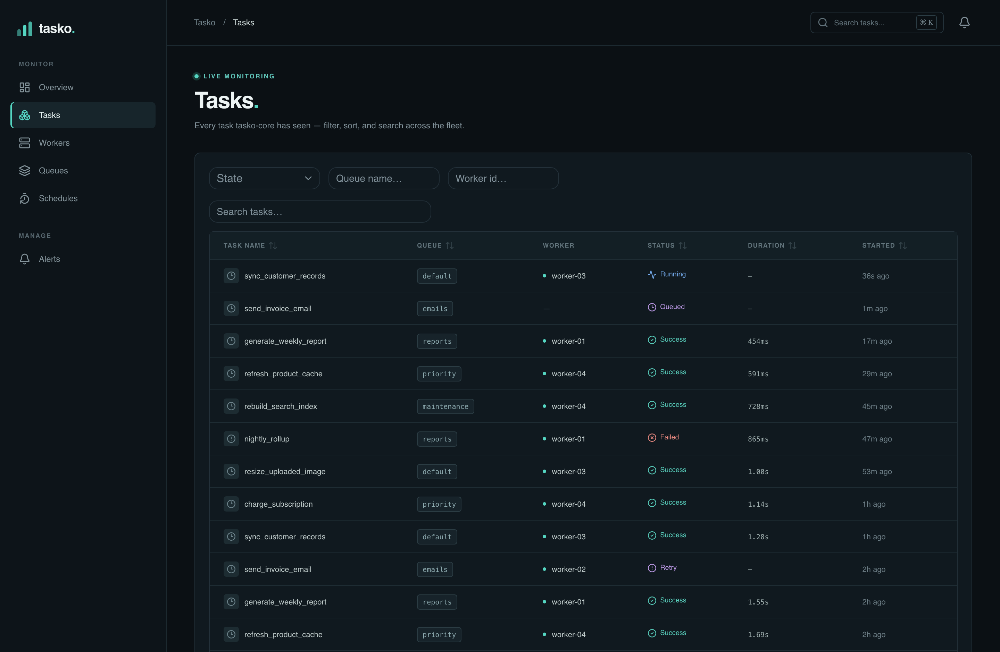
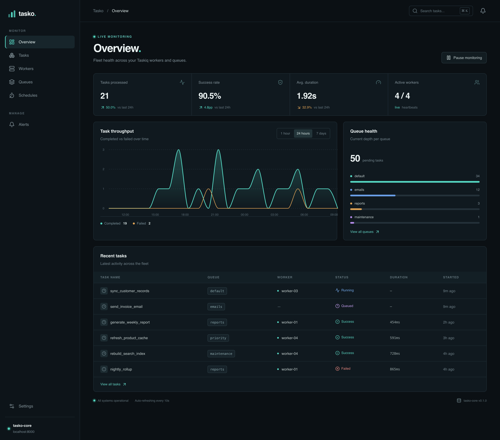
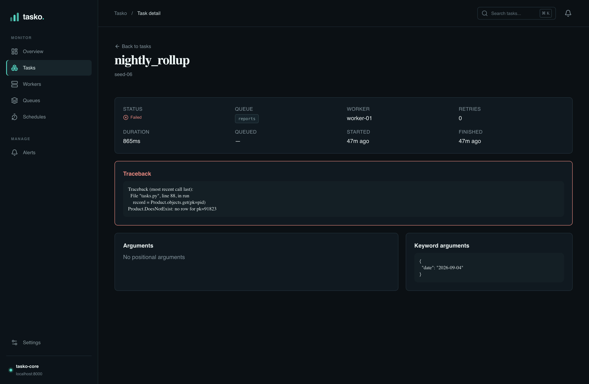
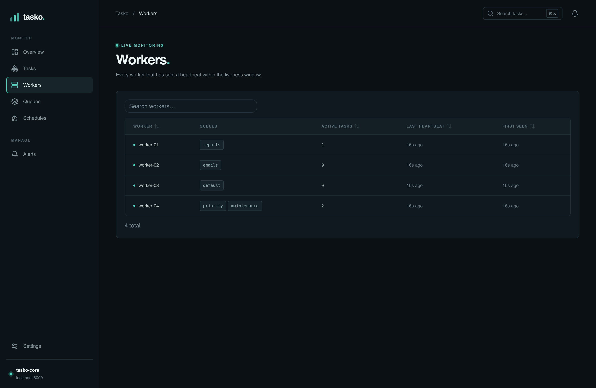
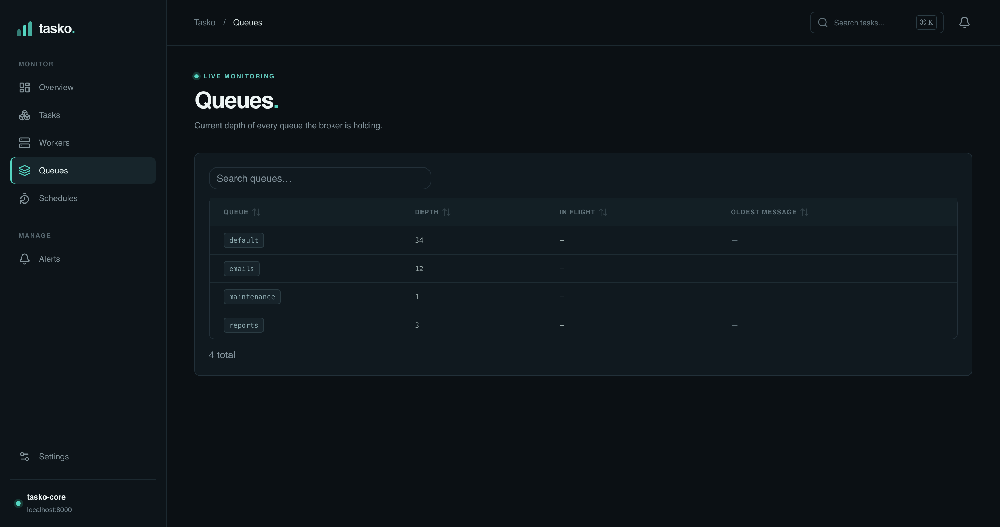
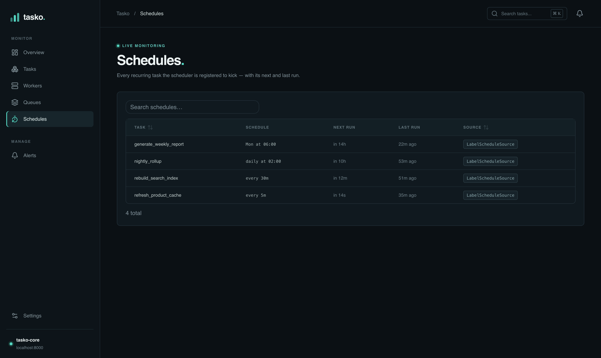

# Tasko

A broker-agnostic observability dashboard for [Taskiq](https://taskiq-python.github.io/)
fleets. Tasko ingests task lifecycle events through a `TaskiqMiddleware`, stores
them, and serves a live REST/WebSocket API consumed by a Next.js dashboard.

> Prototype. v1 scope: `tasko-core` + `tasko-middleware` + `tasko-redis` + `web`.



<details>
<summary>More screenshots</summary>

<br>

**Overview** — fleet health at a glance: 24h throughput, success rate, queue depth, recent activity — all live from the API, auto-refreshing:



**Task detail** — args, kwargs, result, and traceback for any run:



**Workers** — the live fleet, built from `tasko-middleware` heartbeats:



**Queues** — current depth per queue, read straight off the broker:



**Schedules** — recurring tasks the Taskiq scheduler is registered to kick, with next/last run:



</details>

## Layout

| Path                          | What                                                        |
| ----------------------------- | ---------------------------------------------------------- |
| `packages/tasko-core`         | FastAPI server: ingest API, REST/WS, adapter registry      |
| `packages/tasko-middleware`   | `TaskiqMiddleware` subclass that reports events to core    |
| `packages/tasko-redis`        | `BrokerAdapter` implementation for Redis (v1 target)       |
| `packages/tasko-rabbitmq`     | `BrokerAdapter` stub (later / contributors)                |
| `packages/tasko-nats`         | `BrokerAdapter` stub (later / contributors)                |
| `web/`                        | Next.js SSR dashboard                                       |
| `docker/`                     | Multi-stage Dockerfiles + `docker-compose.yml` (dev) + `docker-compose.prod.yml` overlay |

`packages/` and `web/` are independent toolchains — `uv` never touches `web/`,
`pnpm` never touches `packages/`.

## Instrument your fleet

Point `tasko-middleware` at a running `tasko-core` — it's broker-agnostic, it
only reads what Taskiq hands every middleware hook:

```python
from tasko_middleware import TaskoMiddleware

broker = broker.with_middlewares(TaskoMiddleware(core_url="http://localhost:8000"))
```

That covers task lifecycle events and worker heartbeats. For the **Schedules**
view, wrap the `ScheduleSource` you already pass to `TaskiqScheduler`:

```python
from taskiq import TaskiqScheduler
from taskiq.schedule_sources import LabelScheduleSource
from tasko_middleware import TaskoScheduleSource

scheduler = TaskiqScheduler(
    broker,
    sources=[TaskoScheduleSource(LabelScheduleSource(broker),
                                 core_url="http://localhost:8000")],
)
```

It forwards the schedule set to core on startup and whenever it changes;
the scheduler already stamps a `schedule_id` label on each kicked task, so
every run links back to its schedule through the normal event stream.

## Develop

### Python workspace

```bash
# install uv: https://docs.astral.sh/uv/getting-started/installation/
uv sync                       # one venv, one lockfile, whole workspace
uv run tasko-core             # start the server on :8000
uv run tasko-seed             # populate sample workers + tasks + schedules
uv run pytest                 # run the test suite
uv run ruff check .           # lint
```

### Web dashboard

```bash
cd web
pnpm install
pnpm dev                      # http://localhost:3000
```

### Everything at once (Docker)

```bash
# dev stack — source is bind-mounted, core and web both hot-reload
docker compose -f docker/docker-compose.yml up --build
#   dashboard  http://localhost:3100
#   API        http://localhost:8100
#   postgres   localhost:5434  (tasko / tasko)

# production-style stack — built images, no mounts, restart policy
docker compose -f docker/docker-compose.yml -f docker/docker-compose.prod.yml up --build -d

# sample data for the dashboard
docker compose -f docker/docker-compose.yml exec core tasko-seed
```

After changing a dependency (`package.json` / `pyproject.toml`), rebuild:
`docker compose -f docker/docker-compose.yml up --build --renew-anon-volumes`.

## Writing a broker adapter

See [docs/writing-a-broker-adapter.md](docs/writing-a-broker-adapter.md).
